# API Testing Guide ✅

This document contains all successful API test flows for the Alumni Portal project.  
Tested using **Postman**.

---

## 1. Authentication

### Register User
**Endpoint:** `POST /auth/register`  
**Status:** ✅ 201 Created  

**Headers:**
```json
{
  "Content-Type": "application/json"
}
```

**Body (Alumni):**
```json
{
  "full_name": "Alumni One",
  "email": "alumni@example.com",
  "password": "Alumni@123",
  "role": "alumni"
  "phone_number": "+919876543210"
}
```

**Body (Student):**
```json
{
  "name": "Student One",
  "email": "student@example.com",
  "password": "Student!456",
  "role": "student"
  "phone_number":"+919876543210"
}
```

**Body (Admin):**
```json
{
  "name": "Admin One",
  "email": "admin@example.com",
  "password": "Admin@789",
  "role": "admin"
  "phone_number": "+919876543210"
}
```

**Example Response:**
```json
{
  "msg": "user Registered successfully"
}
```

**Screenshots:**  

- **Alumni**  
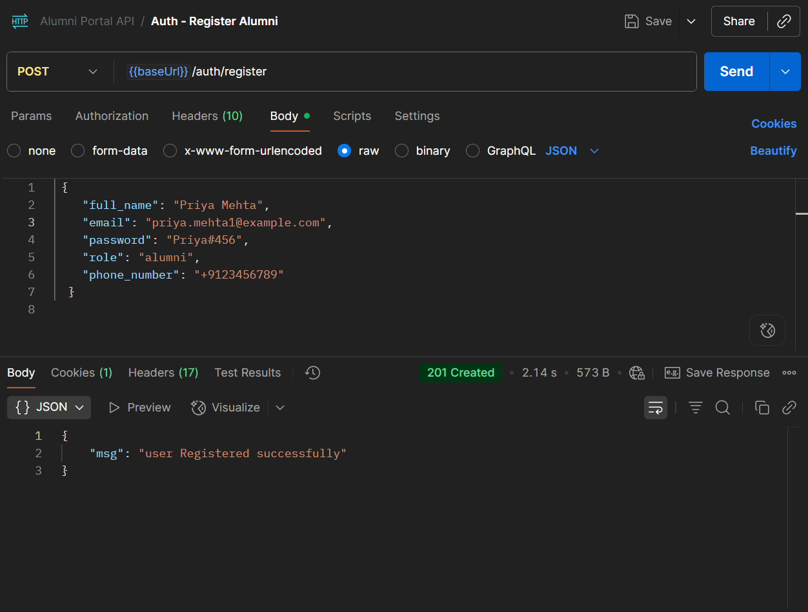

- **Student**  
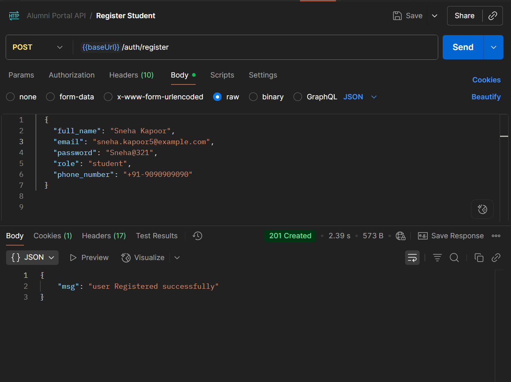

- **Admin**  
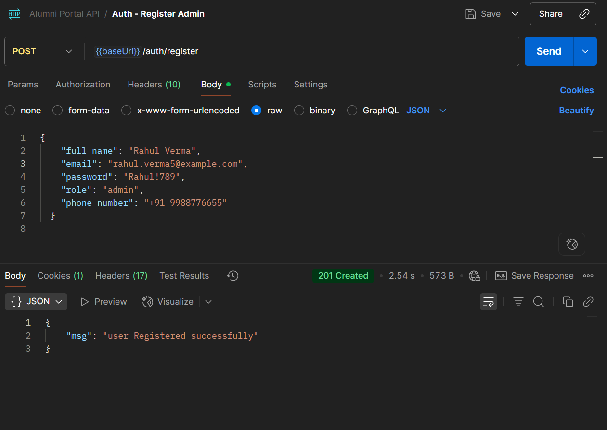

---

### Login User
**Endpoint:** `POST /auth/login`  
**Status:** ✅ 200 OK  

**Headers:**
```json
{
  "Content-Type": "application/json"
}
```

**Body:**
```json
{
  "email": "user@example.com",
  "password": "user@123"
}
```

**Example Response:**
```json
{
  "user": {
     "_id": "68a0685d14d4a7b2c019683",
     "full_name": "User One",
     "email": "user@example.com",
     "role": "role_here"
          }
}
```

**Screenshots:**  

- **Alumni**  
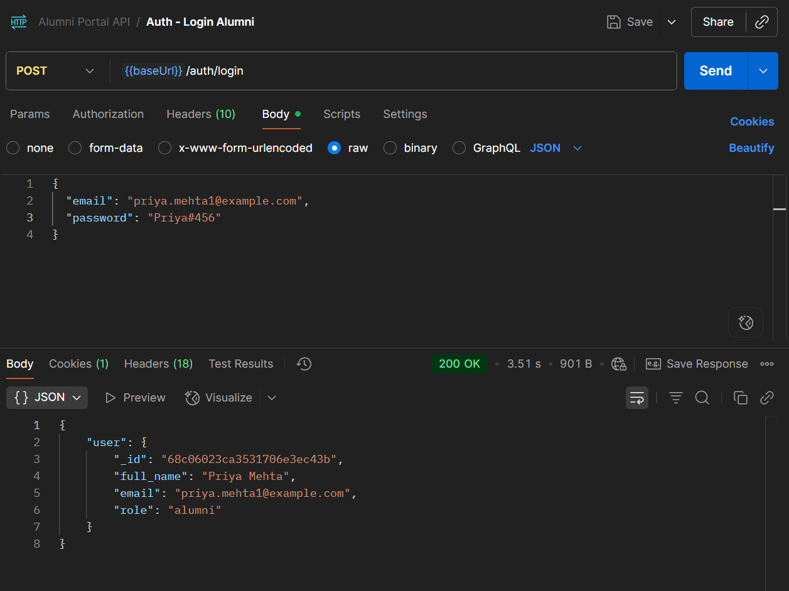

- **Student**  
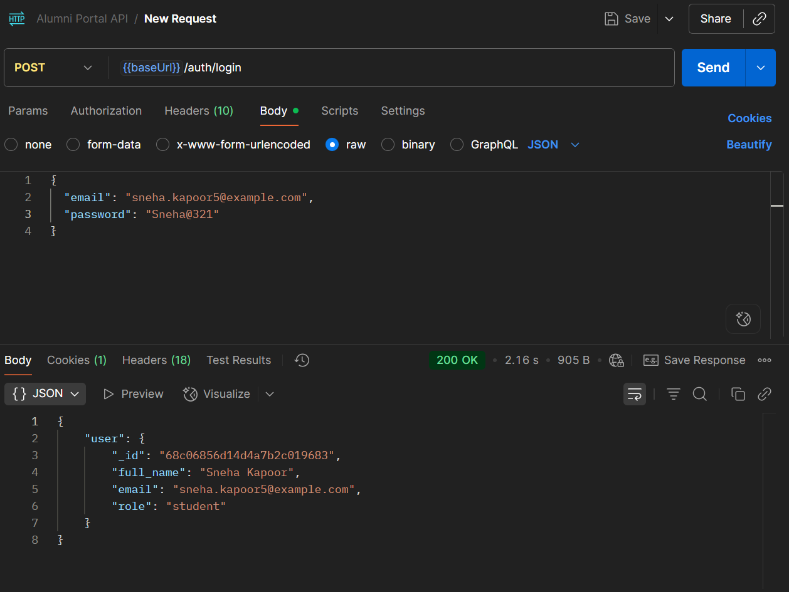

- **Admin**  
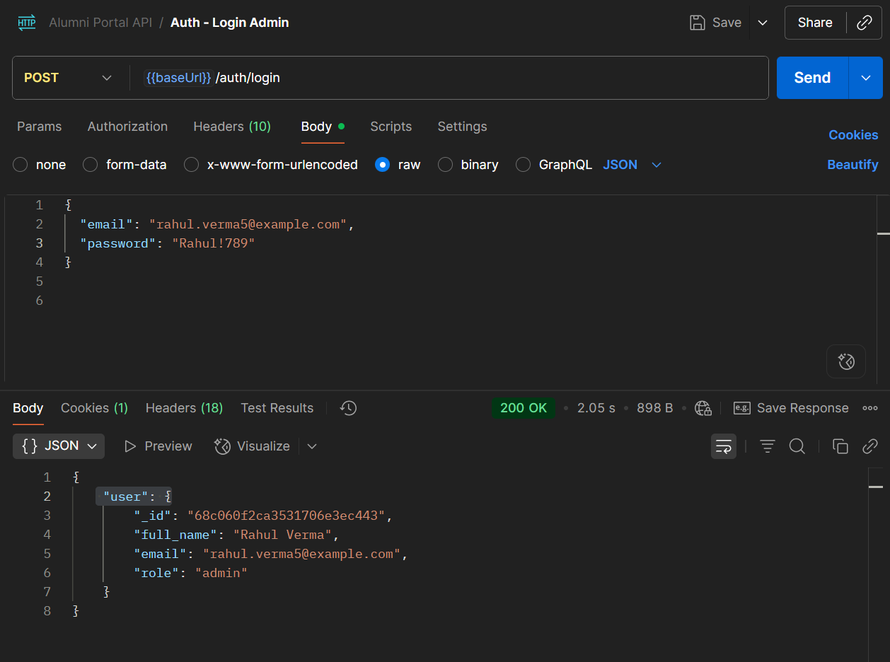

---

### Get Logged-in User
**Endpoint:** `GET /auth/me`  
**Status:** ✅ 200 OK  

**Headers:**
```json
{
  "Authorization": "Bearer jwt_token_here"
}
```

**Example Response:**
```json
{
  "_id": "64f8c123abc456",
  "name": "User One",
  "email": "user@example.com",
  "role": "role_here"
  "phone_number": "+919876543210",
  "created_at": "2025-09-10T08:56:22.438Z"
}
```

**Screenshots:**  

- **Alumni**  
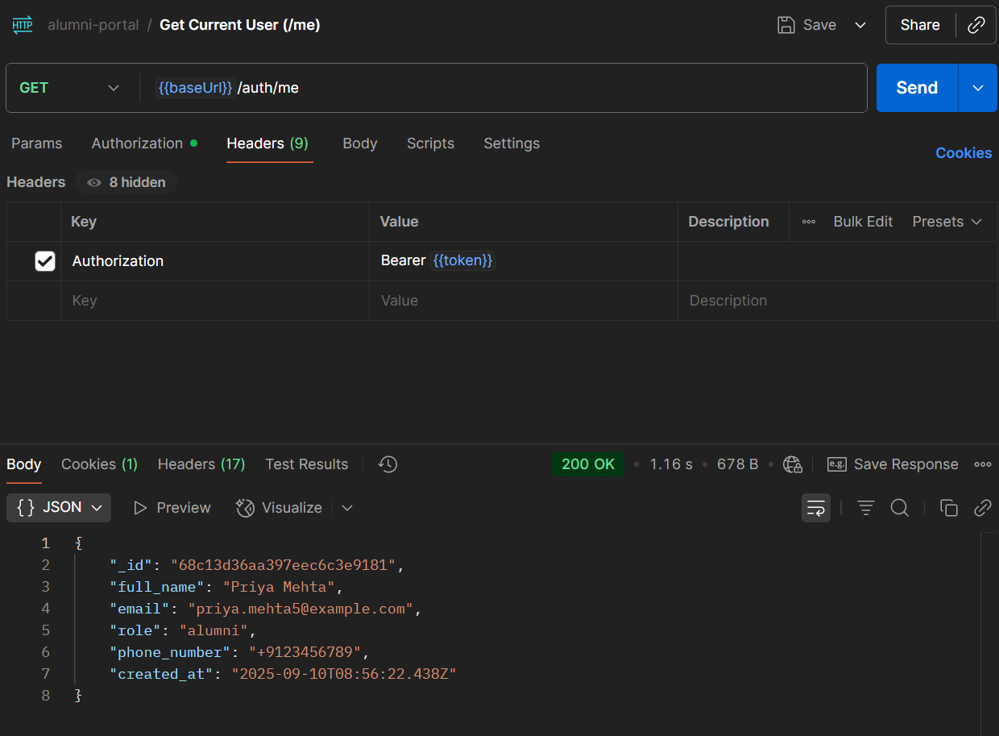

- **Student**  
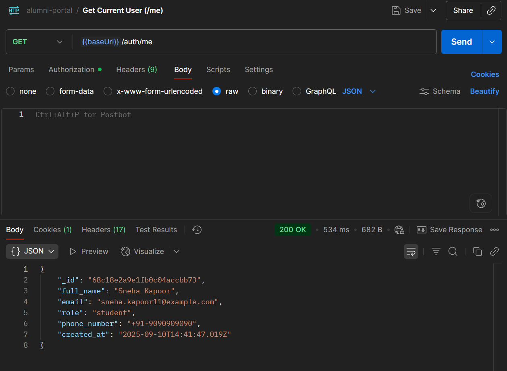

- **Admin**  
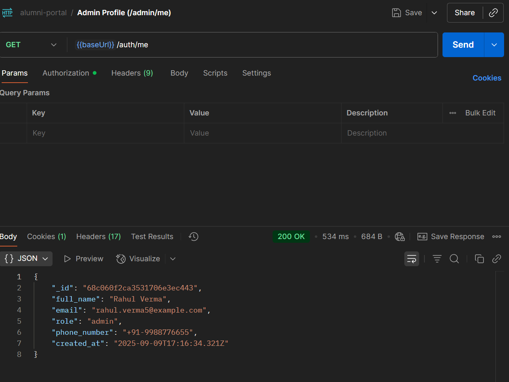

---

## 2. Events

### Admin Creates Event
**Endpoint:** `POST /events/create-event`  
**Status:** ✅ 201 Created  

**Headers:**
```json
{
  "Content-Type": "application/json",
  "Authorization": "Bearer jwt_token_here"
}
```

**Body:**
```json
{
  "title": "Event_Name",
  "description": "Event_Description",
  "date": "2025-09-20",
  "venue": "Event_Venue"
}
```

**Example Response:**
```json
{
  "msg": "Event created successfully",
  "eventId": "64f9a111def222"
}
```

**Screenshots:**  

- **Admin**  
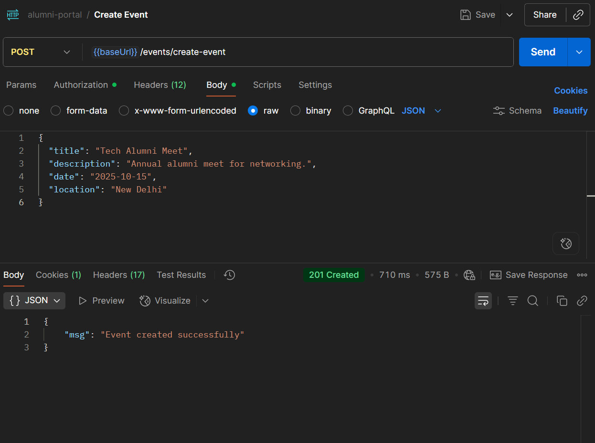

---

### Alumni/Student Register for Event
**Endpoint:** `POST /events/register`  
**Status:** ✅ 200 OK  

**Headers:**
```json
{
  "Content-Type": "application/json",
  "Authorization": "Bearer jwt_token_here"
}
```

**Body:**
```json
{
  "eventId": "64f9a111def222"
  "Authorization": "Bearer jwt_token_here"
}
```

**Example Response:**
```json
{
  "status": "registered"
}
```

**Screenshots:**  

- **User**  
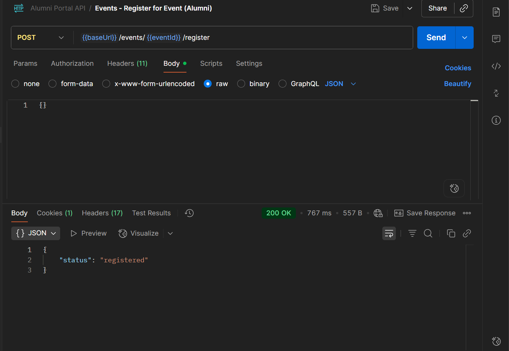

---

### View Events
**Endpoint:** `GET /events/show-events`  
**Status:** ✅ 200 OK  

**Body:**
```json
{}
```

**Example Response:**
```json
{
[
    {
        "_id": "68bb0bb7a7e43170a2e6972f",
        "title": "Event_Name",
        "description": "Event_Description",
        "date": "2025-12-15T00:00:00.000Z",
        "venue": "Event_Venue",
        "participants": [
            "participant_id"
        ]
    }
}
```

**Screenshots:**  

- **Admin**  
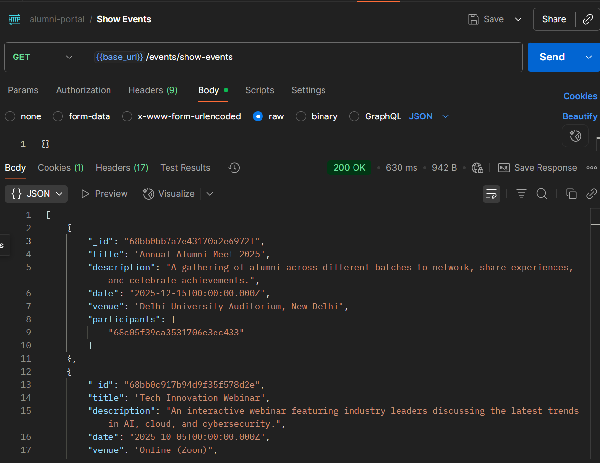

---


## 3. Mentorship

### Student Requests Mentorship
**Endpoint:** `POST /mentorships/request`  
**Status:** ✅ 201 Created  

**Headers:**
```json
{
  "Content-Type": "application/json",
  "Authorization": "Bearer jwt_token_here"
}
```

**Body:**
```json
{
  "mentor_id": "64fab333ghi789",
  "notes": "student_note_here"
}
```

**Example Response:**
```json
{
  "mentor_id": "64f2b7e8a11",
  "mentee_id": "68c18e2a9e1",
  "status": "pending",
  "notes": "student_note_here",
  "_id": "68a23f3e9a1",
  "request_date": "2025-09-10T18:06:24.763Z",
  "__v": 0
}
```

**Screenshots:**  

- **Student**  
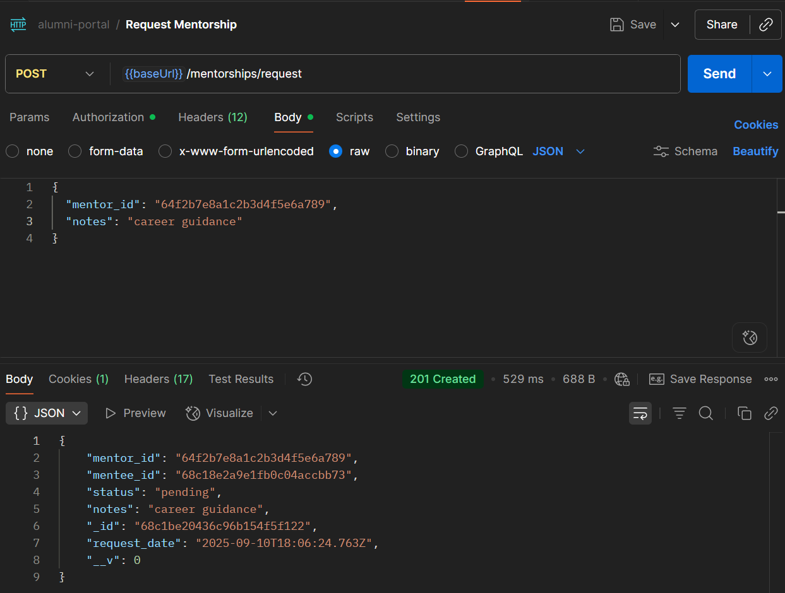

---

### Alumni Accepts/Rejects
**Endpoint:** `PATCH /mentorships/:id/status`  
**Status:** ✅ 200 OK  

**Headers:**
```json
{
  "Content-Type": "application/json",
  "Authorization": "Bearer jwt_token_here"
}
```

**Body (Accept):**
```json
{
  "status": "accepted"
}
```

**Body (Reject):**
```json
{
  "status": "rejected"
}
```

**Example Response:**
```json
{
  "msg": "Mentorship request accepted"
}
```

**Screenshots:**  

- **Alumni**  
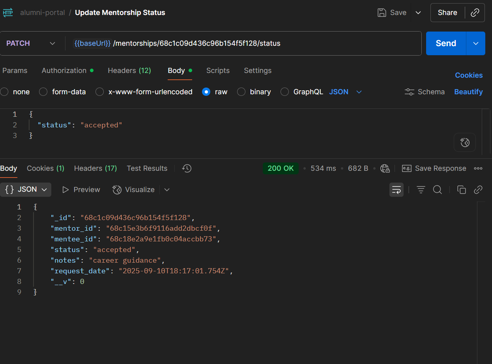

---

### Get mentorships as mentor
**Endpoint:** `GET /mentorships/as-mentor`  
**Status:** ✅ 200 OK  

**Headers:**
```json
{
  "Authorization": "Bearer jwt_token_here"
}
```

**Body:**
```json
{}
```

**Example Response:**
```json
{
[
    {
        "_id": "68c1c09d436c96b154f5f128",
        "mentor_id": "68c15e3b6f9116add2dbcf0f",
        "mentee_id": {
            "_id": "68c18e2a9e1fb0c04accbb73",
            "full_name": "_student_name",
            "email": "student@example.com"
        },
        "status": "pending",
        "notes": "student_notes",
        "request_date": "2025-09-10T18:17:01.754Z",
        "__v": 0
    }
]
}

```

**Screenshots:**  

- **Student**  
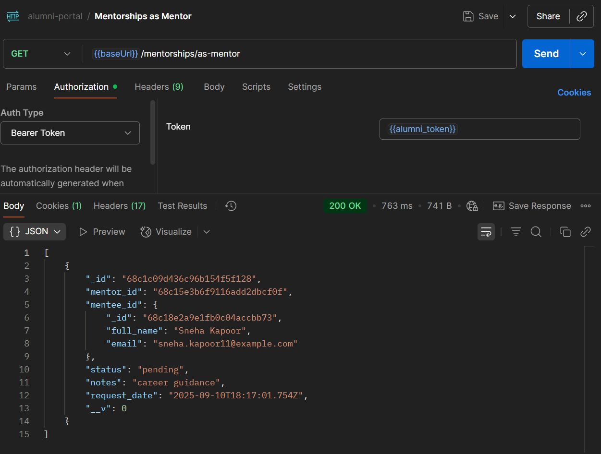

---


## 4. Donations

### Alumni Makes Donation
**Endpoint:** `POST /donations/donate`  
**Status:** ✅ 201 Created  

**Headers:**
```json
{
  "Content-Type": "application/json",
  "Authorization": "Bearer jwt_token_here"
}
```

**Body:**
```json
{
  "amount": 5000,
  "purpose": "fund_name"
}
```

**Example Response:**
```json
{
    "alumni_id": "68c15e3b6f9116add2dbcf0f",
    "amount": 5000,
    "purpose": "Funds",
    "payment_status": "success",
    "_id": "68c1b621436c96b154f5f113",
    "date": "2025-09-10T17:32:17.127Z",
    "__v": 0
}

```

**Screenshots:**  

- **Alumni**  
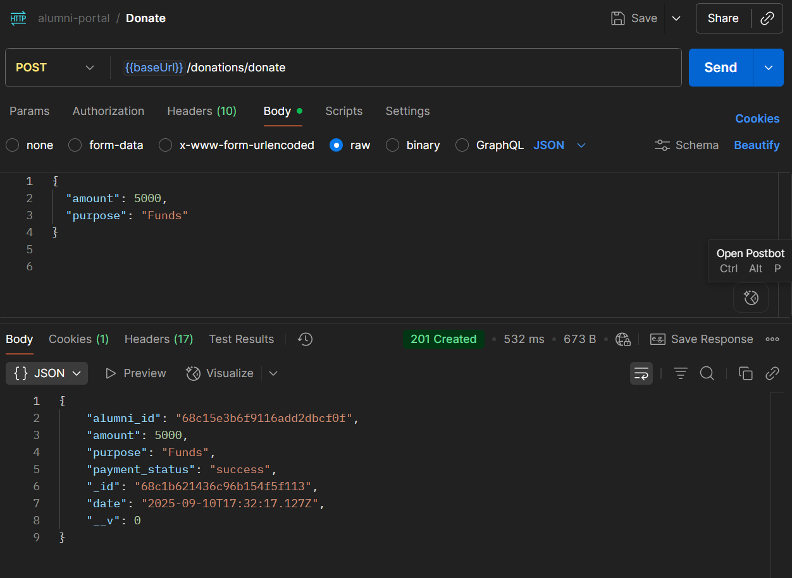

---

### Fetch My Donations
**Endpoint:** `GET /donations/my`  
**Status:** ✅ 200 OK  

**Headers:**
```json
{
  "Authorization": "Bearer jwt_token_here"
}
```

**Example Response:**
```json
[
  {
    "total_amount": 10000,
    "items": [
        {
            "_id": "68c1b5dc436c96b154f5f10e",
            "alumni_id": "68c15e3b6f9116add2dbcf0f",
            "amount": 5000,
            "purpose": "Funds",
            "payment_status": "success",
            "date": "2025-09-10T17:31:08.763Z",
            "__v": 0
        }
]

```

**Screenshots:**  

- **Alumni**  
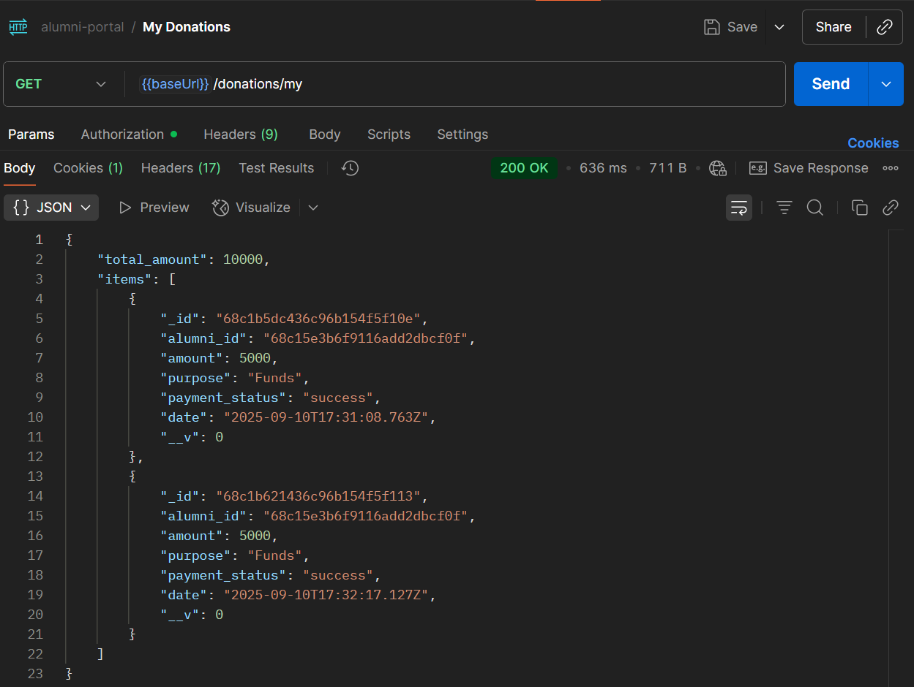

- **Admin**  
.png)

---
